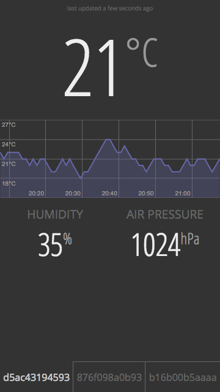

# node-ruuvitag-weather

A simple nodejs-based HTTP server displaying RuuviTag data

## Usage

Start with
```
npm install
node server.js
```
And browse to http://localhost:8000


To populate the ui with dummy data instead of real live data, start with
```
NODE_ENV=test node server.js
```


## Screenshot

